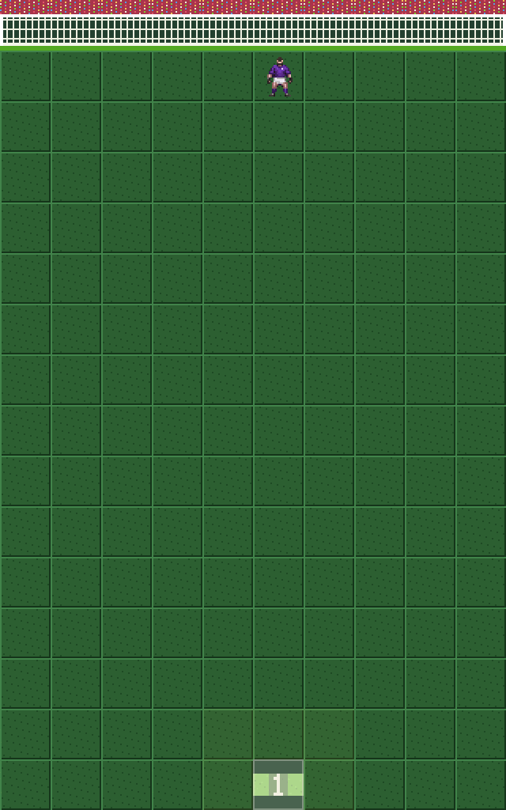
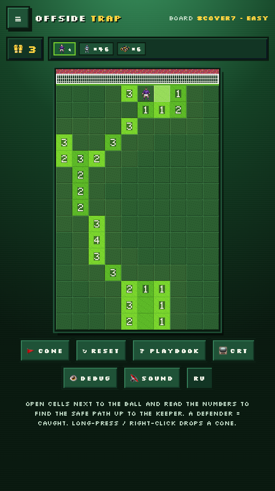
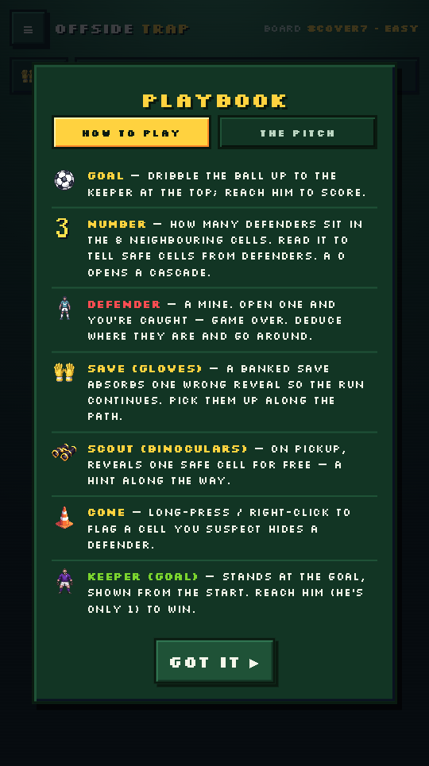
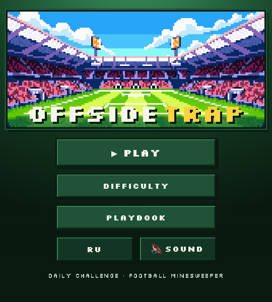

<div align="center">

# ⚽ Offside Trap

### Football minesweeper — read the numbers, find the safe path, beat the keeper.

[**▶ Play in your browser**](https://offside-trap.vercel.app) · [**itch.io**](https://bigmak1.itch.io/offside-trap)



</div>

---

## What is it?

A football-themed take on **Minesweeper**. The defenders are the mines. Read the
numbers to deduce a safe path up the pitch, then dribble the ball past the
defence and slot it past the **keeper** to score.

Every board has a **guaranteed safe path** — it's pure deduction, never a coin
flip. There's a daily challenge, three difficulties, and full English / Russian
support. No install, no tracking — just open and play.

## How to play

- Open a cell next to the ball. A **number** = how many defenders sit in the 8
  surrounding cells.
- A **0** opens up a whole area. Use the numbers to tell safe grass from defenders.
- Step on a defender and you're **caught** — unless you've banked a **SAVE** (gloves).
- Grab **SAVES** and **SCOUTS** (a free safe-cell reveal) along the way.
- Reach the **keeper** at the top of the pitch to score the goal.
- **Long-press / right-click** to drop a **cone** on a cell you suspect.

## Features

- 🧠 **Pure deduction** — every board is solvable, no guessing required.
- 📅 **Daily challenge** + three difficulties (Easy / Normal / Hard).
- 🎨 **Handcrafted pixel art**, chiptune SFX and a stadium atmosphere.
- 🌍 **English & Russian**, plays on desktop and mobile.
- 📦 **Zero dependencies** — vanilla HTML5 / Canvas / JS, no engine, no build step.

## Screenshots

<p align="center">
  
  
  
</p>

## Made with AI 🤖

Offside Trap was built as a "vibe coding → vibe shipping" experiment — assisted
by AI end to end:

- **Art** — all pixel sprites generated via [PixelLab](https://pixellab.ai)
  (the prompts and build scripts live in [`assets/_build/`](assets/_build)).
- **Audio** — AI-generated music and stadium ambience.
- **Code** — written with an AI pair (vanilla JS, hand-reviewed).
- **Shipping** — store copy, the gameplay GIF, screenshots and the
  [TikTok promo clips](dist/tiktok) were all produced with AI too.

## Run it locally

It's a fully static site — serve the folder with any static server:

```bash
python3 -m http.server 8000
# then open http://localhost:8000
```

## Project layout

```
index.html            # single-page game shell
styles.css            # pixel-art UI
js/
  config.js  rng.js   # difficulty presets + seeded RNG (daily / solvable boards)
  i18n.js             # EN / RU strings
  game.js  render.js  # deduction engine + Canvas renderer
  sfx.js   main.js    # audio + wiring
assets/               # sprites, fonts, audio
  _build/             # PixelLab generation scripts (provenance, dev-only)
dist/
  itch-assets/        # cover, gameplay GIF, screenshots
  tiktok/             # promo clips (EN + RU)
  presentation/       # "how it shipped" deck (open deck.html in a browser)
```

---

<div align="center">

Made with ⚽ and a lot of AI · [Play now →](https://offside-trap.vercel.app)

</div>
